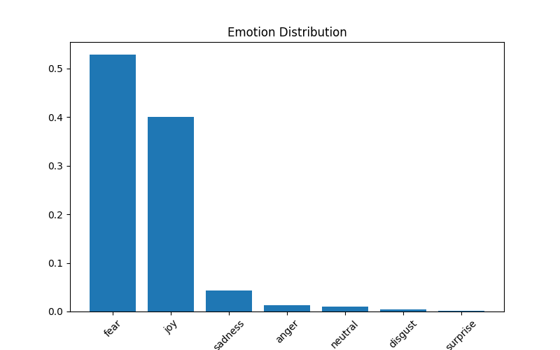
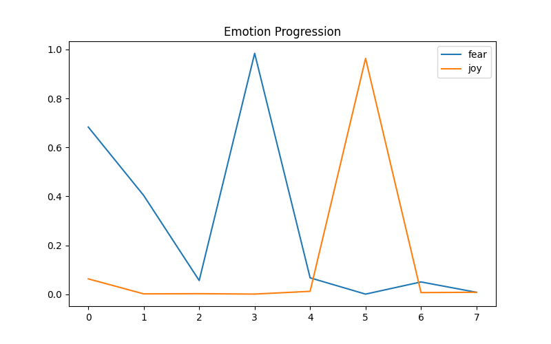

Emotion Analysis in Song Lyrics using NLP,
This project explores how AI interprets emotions in song lyrics using a pre-trained NLP model, and compares it with human understanding.

---

 Objective,
To analyze emotional patterns in song lyrics and understand the gap between human interpretation and AI classification.

---

 Method,
Model: DistilRoBERTa (HuggingFace),
Task: Emotion Classification,
Approach:
Per-line emotion analysis,
Emotion progression tracking,
Quantitative scoring (frequency & average),
,

---

 Results,
Emotion Distribution,

Emotion Progression,

---

 Key Insights,
Fear is the most dominant emotion across the lyrics,
Joy appears as a brief but intense emotional peak,
Neutral states act as transitions between emotional phases,
The emotional pattern suggests a progression from anxiety to release,

---

 Limitations,
AI relies on keywords and fails to capture deeper symbolic meaning,
Emotional states are treated as discrete, not overlapping,
Concepts like “healing” or “transformation” are not explicitly detected,

---

 Tools,
Python,
HuggingFace Transformers,
Matplotlib,

---

1. How to Run
Install dependencies:
pip install -r requirements.txt

2. Open:
notebook/song-analysis.ipynb

3. Run all cells

---

 Author,
nasaka
